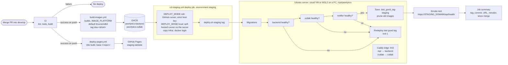
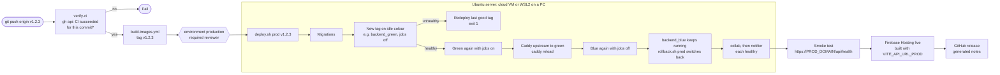

# CD pipeline (report Figure 3.13)

How a change reaches staging, and a version tag reaches production. Details: [../deploy.md](../deploy.md).

```mermaid
flowchart LR
  dev([Merge PR into develop]) --> ci[CI<br/>lint, tests, build]
  ci -- failure --> stop([No deploy])
  ci -- success on push --> build[build-images.yml<br/>buildx, IMAGE_PLATFORM<br/>default linux/amd64<br/>tag sha-&lt;short&gt;]
  ci -- success on push --> pages[deploy-pages.yml<br/>Vite build, base /&lt;repo&gt;/]
  build --> ghcr[(GHCR<br/>peerlytics-backend<br/>peerlytics-collab)]
  pages --> gp[GitHub Pages<br/>staging website]

  subgraph job[cd-staging.yml deploy job, environment staging]
    ssh[DEPLOY_MODE ssh: GitHub runner, strict host key<br/>DEPLOY_MODE local: self-hosted runner on the server<br/>copy infra/, docker login] --> deploy[deploy.sh staging tag]
  end
  ghcr --> ssh

  subgraph server[Ubuntu server: cloud VM or WSL2 on a PC, /opt/peerlytics]
    deploy --> mig[Migrations]
    mig --> be[backend healthy?]
    be --> co[collab healthy?]
    co --> no[notifier healthy?]
    no -- yes --> save[Save .last_good_tag-staging<br/>prune old images]
    be -- no --> rb[Redeploy last good tag<br/>exit 1]
    co -- no --> rb
    no -- no --> rb
    caddy[Caddy edge :443<br/>/api → backend<br/>/collab → collab]
  end

  save --> smoke[Smoke test<br/>https://STAGING_DOMAIN/api/health]
  smoke --> summary[Job summary<br/>tag, commit, URL, minutes since merge]
```

## Production (step 5.1)

```mermaid
flowchart LR
  tag([git push origin v1.2.3]) --> verify[verify-ci<br/>gh api: CI succeeded<br/>for this commit?]
  verify -- no --> stop([Fail])
  verify -- yes --> build[build-images.yml<br/>tag v1.2.3]
  build --> approve{{environment production<br/>required reviewer}}
  approve --> deploy[deploy.sh prod v1.2.3]

  subgraph server[Ubuntu server: cloud VM or WSL2 on a PC]
    deploy --> mig[Migrations]
    mig --> idle[New tag on idle colour<br/>e.g. backend_green, jobs off]
    idle -- unhealthy --> rb[Redeploy last good tag<br/>exit 1]
    idle -- healthy --> on[Green again with jobs on]
    on --> switch[Caddy upstream to green<br/>caddy reload]
    switch --> off[Blue again with jobs off]
    off --> keep[backend_blue keeps running<br/>rollback.sh prod switches back]
    keep --> rest[collab, then notifier<br/>each healthy]
  end

  rest --> smoke[Smoke test<br/>https://PROD_DOMAIN/api/health]
  smoke --> web[Firebase Hosting live<br/>built with VITE_API_URL_PROD]
  web --> rel[GitHub release<br/>generated notes]
```
