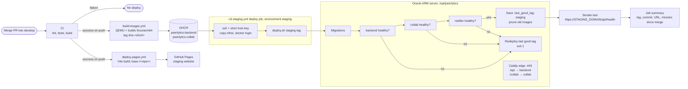

# CD pipeline (report Figure 3.13)

How a change reaches staging. Details: [../deploy.md](../deploy.md).

```mermaid
flowchart LR
  dev([Merge PR into develop]) --> ci[CI<br/>lint, tests, build]
  ci -- failure --> stop([No deploy])
  ci -- success on push --> build[build-images.yml<br/>QEMU + buildx linux/arm64<br/>tag sha-&lt;short&gt;]
  ci -- success on push --> pages[deploy-pages.yml<br/>Vite build, base /&lt;repo&gt;/]
  build --> ghcr[(GHCR<br/>peerlytics-backend<br/>peerlytics-collab)]
  pages --> gp[GitHub Pages<br/>staging website]

  subgraph job[cd-staging.yml deploy job, environment staging]
    ssh[ssh + strict host key<br/>copy infra/, docker login] --> deploy[deploy.sh staging tag]
  end
  ghcr --> ssh

  subgraph server[Oracle ARM server, /opt/peerlytics]
    deploy --> mig[Migrations]
    mig --> be[backend healthy?]
    be --> co[collab healthy?]
    co --> no[notifier healthy?]
    no -- yes --> save[Save .last_good_tag-staging<br/>prune old images]
    be -- no --> rb[Redeploy last good tag<br/>exit 1]
    co -- no --> rb
    no -- no --> rb
    caddy[Caddy edge :443<br/>/api → backend<br/>/collab → collab]
  end

  save --> smoke[Smoke test<br/>https://STAGING_DOMAIN/api/health]
  smoke --> summary[Job summary<br/>tag, commit, URL, minutes since merge]
```
